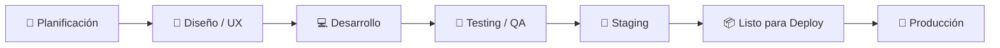
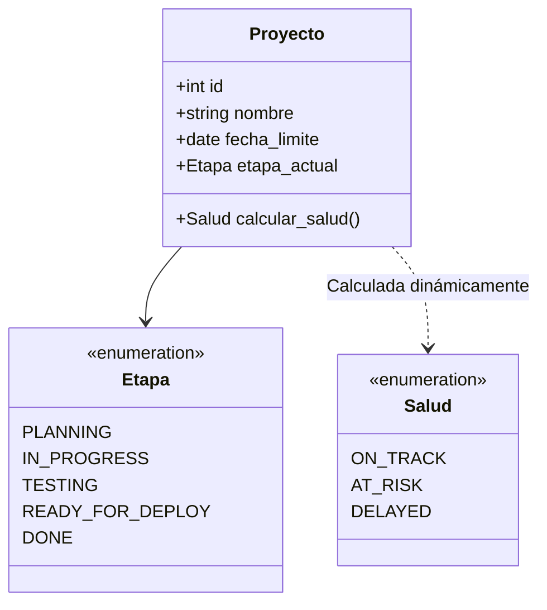

# 📊 Clasificación y Definición de Estados del Proyecto

Para la gestión y visualización dentro del **Dashboard de Seguimiento**, los estados se dividen en **dos dimensiones complementarias**:

1. **Salud / Riesgo del Proyecto:** Indicador de viabilidad respecto a plazos y compromisos (ideal para semáforos ejecutivos).
2. **Ciclo de Vida / Etapas Técnicas:** El flujo secuencial del pipeline de trabajo por el que avanza cada proyecto o hito.

---

## 1. Estados de Salud y Riesgo (Nivel Ejecutivo)

Responden a la pregunta clave: **¿El proyecto llegará a tiempo a la fecha comprometida de producción?**

| Nivel / Color | Estado (ES / EN) | Código Sugerido | Descripción y Criterio |
| :---: | :--- | :---: | :--- |
| 🟢 | **En Regla** *(On Track)* | `ON_TRACK` | El progreso avanza de acuerdo al cronograma previsto. Sin bloqueos significativos. |
| 🟡 | **En Riesgo** *(At Risk)* | `AT_RISK` | Desvíos menores, dependencias trabadas o alertas tempranas que amenazan la fecha de entrega si no se mitigan. |
| 🔴 | **Retrasado / Crítico** *(Critical / Delayed)* | `DELAYED` | Ha superado una fecha límite de entrega o la fecha estimada excede la fecha de producción acordada. |
| ⚪ | **Pausado** *(On Hold)* | `ON_HOLD` | Congelado temporalmente por falta de recursos, cambio de prioridades o decisión del cliente/negocio. |
| ⚫ | **Cancelado** *(Cancelled)* | `CANCELLED` | El proyecto fue dado de baja definitivamente antes de su conclusión. |

---

## 2. Estados de Ciclo de Vida / Etapas Técnicas (Flujo Operativo)

Representan la **fase activa** en la que se encuentra el desarrollo del software:

### Detalle de cada fase

* **`PLANNING` — Planificación / Backlog:** Definición de requerimientos, alcance funcional, arquitectura técnica y estimación inicial.
* **`DESIGN` — En Diseño / UX-UI:** Creación de mockups, prototipos de pantalla y modelado conceptual/base de datos.
* **`IN_PROGRESS` — En Desarrollo:** Construcción activa de código y funcionalidades por parte del equipo de desarrollo.
* **`TESTING` — En Testing / QA:** Ejecución de pruebas funcionales, de integración y reporte/resolución de bugs.
* **`STAGING` — En Staging / Pre-producción:** Validación final en un entorno réplica de producción con datos de prueba.
* **`READY_FOR_DEPLOY` — Listo para Deploy:** Aprobado por QA y negocio; a la espera de la ventana o fecha de pase programada.
* **`DONE` — Completado / En Producción:** Release desplegado exitosamente y disponible para los usuarios finales.

---

## 3. Propuesta de Arquitectura para el MVP

Para mantener el modelo de datos simple, robusto y fácil de implementar con **FastAPI** y **SQLite**:

### Estrategia recomendada

1. **Campo persistente `etapa` (Almacenado en DB):**
   * *Pipeline simplificado:* `Planificación` ➔ `Desarrollo` ➔ `Testing` ➔ `Listo para Deploy` ➔ `Finalizado`.

2. **Indicador calculado `salud` (Lógica de Negocio en Backend o Frontend):**
   * Se evalúa comparando la **fecha actual**, el **progreso/etapa** y la **fecha objetivo de producción**:
     * **🟢 On Track:** La fecha límite está lejana y el avance es normal.
     * **🟡 At Risk:** Faltan pocos días para la fecha límite y el proyecto sigue en etapas tempranas.
     * **🔴 Delayed:** La fecha actual superó la fecha límite sin haber alcanzado el estado *Finalizado*.

> [!TIP]
> **Ventaja de este enfoque:** Evita que el usuario tenga que actualizar dos campos manuales de estado y permite generar métricas automáticas en las tarjetas del dashboard.
